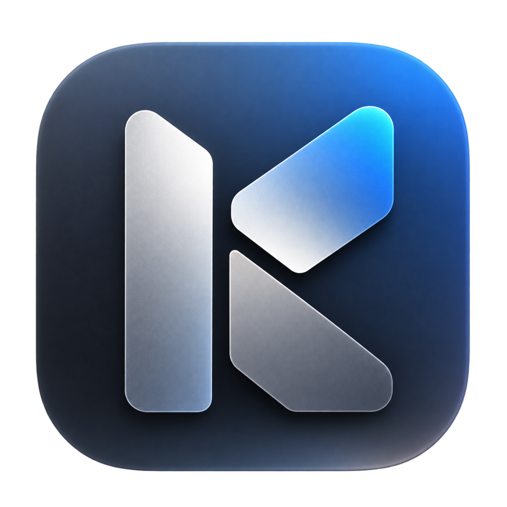
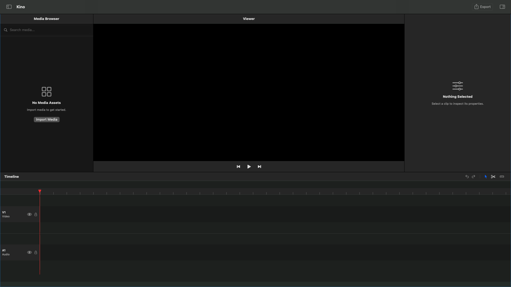
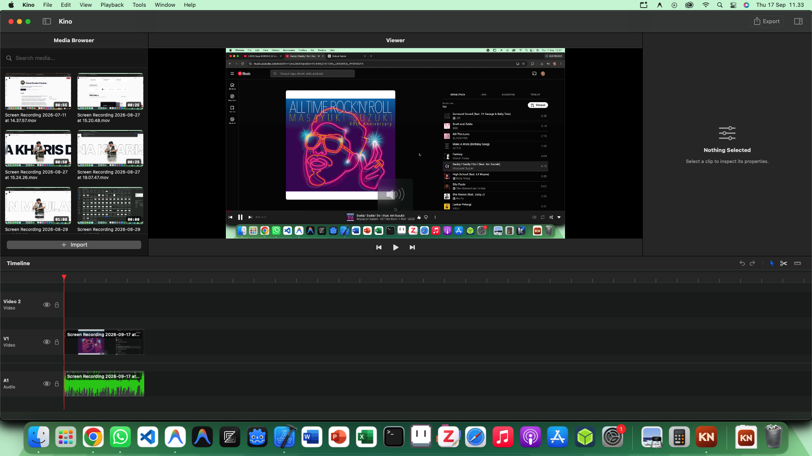
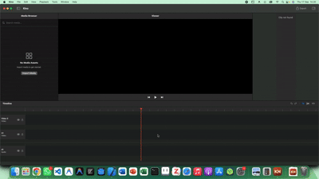

<div align="center">
  
  <h1>Kino</h1>
  <strong>A native macOS video editor built for learning. Filesystem-first.</strong>
  <br/><br/>

  
  
  
  

  <br/>
  <sub>Built from the ground up for Apple Silicon. No cross-platform wrappers.</sub>
</div>

<br/>

---

<details>
<summary><strong>Table of Contents</strong></summary>

- [English](#english)
  - [What is Kino](#what-is-kino)
  - [Why Kino](#why-kino)
  - [Project Status & Limitations](#project-status--limitations)
  - [Features](#features)
  - [Architecture](#architecture)
  - [Getting Started](#getting-started)
  - [Keyboard Shortcuts](#keyboard-shortcuts)
  - [Roadmap](#roadmap)
  - [Contributors](#contributors)
  - [License](#license)
- [Bahasa Indonesia](#bahasa-indonesia)
  - [Apa itu Kino](#apa-itu-kino)
  - [Mengapa Kino](#mengapa-kino)
  - [Status Proyek & Keterbatasan Saat Ini](#status-proyek--keterbatasan-saat-ini)
  - [Fitur](#fitur)
  - [Arsitektur](#arsitektur)
  - [Cara Memulai](#cara-memulai)
  - [Pintasan Keyboard](#pintasan-keyboard)
  - [Peta Jalan](#peta-jalan-roadmap)
  - [Kontributor](#kontributor)
  - [Lisensi](#lisensi)

</details>

---

# English

## What is Kino

Kino is a non-linear video editor (NLE) built entirely in Swift for macOS. It uses SwiftUI for the interface, AVFoundation for media processing, and CoreImage for compositing.

<div align="center">
  
  <br/><i>Initial empty workspace when opening the app</i><br/><br/><br/>
  
  
  <br/><i>Populated workspace with video and media assets</i><br/><br/><br/>
  
  
  <br/><i>Workflow demo: From app launch to opening a project</i>
</div>

While professional NLEs like Final Cut Pro set the standard for native macOS performance, Kino differentiates itself through a filesystem-first approach, modular architecture, and an intentionally educational codebase. Every line of code is written specifically for macOS, taking advantage of hardware-accelerated decoding and Metal-backed rendering.

Furthermore, Kino introduces a **Filesystem-First** and **Modular Feature Architecture**. It doesn't trap your media in hidden libraries, and it doesn't force unnecessary features. The lightweight "Core" provides a foundational editing workflow, while 14 advanced optional modules (like Professional Color, Audio Pro, and Advanced Subtitles) can be plugged in when you need them.

The result is an editor designed for quick launch times, smooth rendering, and scalability.

## Why Kino

There are plenty of video editors out there. Here is why Kino exists:

- **Native macOS Experience.** Built entirely with SwiftUI and AppKit, compiled directly for macOS. While professional closed-source editors like Final Cut Pro set the standard for native performance, Kino offers a transparent, educational alternative. It integrates naturally with the OS (native window management, dark mode, Retina displays) while keeping its implementation open for you to study.
- **Lightweight & Modular.** The application binary is kept small. With our modular architecture, you only install the advanced tools you actually use, helping the core editor remain fast and focused.
- **Filesystem-First & Non-Destructive.** Source media belongs to you. Kino does not create hidden duplicate media libraries. Your original video, audio, and image files remain untouched in your chosen folders, and every timeline operation is strictly non-destructive. Under the hood, the `MediaService` uses Security-Scoped Bookmarks to maintain persistent references to your files across app launches without copying the raw data.
- **Predictable.** Every edit operation goes through the Command Pattern. This means the application state is deterministic. If something goes wrong, the undo stack knows exactly how to reverse it.
- **Educational.** The codebase is deliberately kept clean and approachable. If you are learning SwiftUI, AVFoundation, or macOS app architecture, this project serves as an open, real-world reference for building complex native applications.

## Project Status & Limitations

Kino is currently moving towards its v1.0 release. It is being developed by a small team as an open, educational project, rather than a massive enterprise application.

- **Media Support**: While AVFoundation supports many formats, testing has been primarily limited to standard H.264/HEVC (`.mp4`, `.mov`) files. Professional formats (like ProRes or RAW) have not been extensively benchmarked.
- **Stability**: As an active project, you may encounter bugs. It is not yet recommended for mission-critical production work.

## Features

| Feature | Description |
|---|---|
| **Multi-Track Timeline** | Unlimited video and audio tracks with proper Z-index compositing. Higher tracks visually occlude lower ones, just like Premiere Pro and Final Cut. |
| **Auto-Overlay** | Drop a clip on top of another and Kino automatically places it on a higher track instead of overwriting. No more accidental deletions. |
| **Linked Audio/Video** | Importing a video automatically extracts and links its audio track. Move them together, or right-click to unlink for precise J/L cuts. |
| **GPU Playback** | The playback engine wraps `AVMutableComposition` with custom `AVMutableVideoComposition` instructions for real-time opacity, scale, and transform blending. |
| **Real Waveforms** | Audio waveforms are generated from actual 16-bit PCM sample data via `AVAssetReader`, not random squiggly lines. Silent tracks show as flat lines so you know immediately. |
| **Thumbnail Cache** | A thread-safe in-memory cache ensures that scrolling through hundreds of media assets stays at 60fps. Thumbnails and waveforms are generated once, then served from memory. |
| **Inspector Panel** | Adjust position, scale, and rotation through precise sliders, or drag directly on the canvas for visual editing. |
| **Command Pattern** | Every timeline action is wrapped in a reversible command object (`MoveClipCommand`, `SplitClipCommand`, `CompositeCommand`), providing the foundation for full undo/redo history. |

## Architecture

Kino follows a clean, layered architecture that separates concerns strictly:

```
Kino/
  App/                  # Application entry point and lifecycle
  Core/
    Domain/             # Pure data models: Clip, Track, Sequence, MediaAsset
    Services/           # Business logic: PlaybackEngine, MediaService, TimelineService
    Commands/           # Command pattern: reversible actions for undo/redo
  UI/
    Timeline/           # Timeline rendering: ClipView, TrackView, TimelineRulerView
    Viewer/             # Video canvas with interactive transform handles
    Inspector/          # Property panel for clip manipulation
    MediaBrowser/       # Asset library with drag-and-drop support
    State/              # WorkspaceState - single source of truth
    Workspace/          # Main layout and export modal
```

**Key design decisions:**

- **Single Source of Truth.** `WorkspaceState` is an `@EnvironmentObject` that owns all project data. Every view reads from it; every mutation goes through it. No stale state, no sync bugs.
- **Domain Isolation.** `Clip`, `Track`, `Sequence`, and `MediaAsset` are plain Swift structs with zero UI dependencies. They can be serialized, tested, and reasoned about independently.
- **Service Layer.** `PlaybackEngine` handles all AVFoundation complexity. `MediaService` manages file access and bookmark resolution. `TimelineService` handles clip placement logic. Views never touch AVFoundation directly.
- **Coordinate Precision.** Timeline drag-and-drop uses named SwiftUI `CoordinateSpace` instances for pixel-accurate hit testing across nested scroll views.

## Getting Started

**Requirements:**
- macOS 12.0 Monterey or later
- Xcode 15.0 or later
- Apple Silicon recommended (Intel supported)

**Build and Run:**
1. Clone this repository
2. Open `Kino.xcodeproj` in Xcode
3. Select the "Kino" scheme and "My Mac" as the destination
4. Press `Cmd + R`

No SPM dependencies. No CocoaPods. No setup scripts. Just open and build.

## Keyboard Shortcuts

| Shortcut | Action |
|---|---|
| `Space` | Play / Pause |
| `Cmd + Z` | Undo |
| `Cmd + Shift + Z` | Redo |
| `Cmd + I` | Import Media |
| `Cmd + S` | Save Project |
| `Cmd + E` | Export Video |
| `Delete` | Delete Selected Clip |

## Roadmap

Kino uses a **Modular Feature Strategy**. The Core provides a complete basic editing workflow, while advanced features are implemented as optional modules.

### v1.0 Target: Core + 6 Modules

| Status | Feature |
|---|---|
| ✅ Stable | Multi-track timeline with drag-and-drop |
| ✅ Stable | Linked audio/video clips |
| ✅ Stable | Real-time waveform visualization |
| ✅ Stable | Hardware-accelerated playback engine |
| ✅ Stable | Video export pipeline |
| ✅ Stable | Full undo/redo history |
| ✅ Stable | Razor / Blade tool (Split clips) |
| ✅ Stable | Clip edge trimming (Drag to resize) |
| ✅ Stable | Text and title overlays |
| 📋 Planned | Module 1: Effects |
| 📋 Planned | Module 2: Transitions |
| 📋 Planned | Module 3: Advanced Subtitles |
| 📋 Planned | Module 4: Professional Color |
| 📋 Planned | Module 5: Audio Pro |
| 📋 Planned | Module 6: Advanced Export |

### Future Modules
Future releases will introduce: Motion Graphics, Pro Media / Codecs, Masking & Tracking, AI Tools, Advanced Proxy, Social Media Presets, Templates, and Integrations.

## Contributors

<table>
  <tr>
    <td align="center">
      <a href="https://github.com/Kharisdestianmaulana-hub">
        <br />
        <sub><b>Kharis Destian Maulana</b></sub>
      </a><br />
      <span title="Creator & Maintainer">👑</span>
    </td>
  </tr>
</table>

We welcome contributions from the community! See the [Contributors Graph](https://github.com/Kharisdestianmaulana-hub/Kino/graphs/contributors) for a full list of people who have helped build Kino.

## License

This project is licensed under the **PolyForm Shield License 1.0.0**.

You are free to read, study, and learn from this code. You may not use it to build a competing product or commercial service. See `LICENSE` for the full terms.

**Mini-FAQ:**
- **Can I fork and modify this code for my own personal use, without distributing it?**
  Yes. Under the PolyForm Shield 1.0.0 license, you are free to modify and use the software for personal projects or internal tools, as long as you do not distribute or offer it as a competing video editing product or service.
- **Can I use this code for my own personal/commercial project?**
  Yes, as long as your project is NOT a competing video editing product or service.

Interested in contributing? Read `CONTRIBUTING.md` for guidelines on bug reports, feature requests, and pull requests.

---
---

# Bahasa Indonesia

## Apa itu Kino

Kino adalah aplikasi penyunting video non-linear (NLE) yang dibangun sepenuhnya dalam bahasa Swift untuk macOS. Kino menggunakan SwiftUI untuk antarmuka, AVFoundation untuk pemrosesan media, dan CoreImage untuk komposisi visual.

<div align="center">
  
  <br/><i>Tampilan awal saat aplikasi baru dibuka</i><br/><br/><br/>
  
  
  <br/><i>Tampilan saat workspace sudah terisi video dan aset media</i><br/><br/><br/>
  
  
  <br/><i>Demo alur kerja: Dari awal membuka aplikasi hingga memuat project</i>
</div>

Meski editor profesional seperti Final Cut Pro telah menetapkan standar performa native di macOS, Kino membedakan dirinya melalui pendekatan filesystem-first, arsitektur modular, dan basis kode yang sengaja dibuat edukatif. Setiap baris kode ditulis spesifik untuk macOS, memanfaatkan akselerasi perangkat keras untuk decoding dan rendering berbasis Metal.

Lebih dari itu, Kino memperkenalkan arsitektur **Filesystem-First** dan **Fitur Modular**. Aplikasi ini tidak mengurung aset media Anda di dalam pustaka tersembunyi, dan tidak menyertakan fitur yang belum tentu terpakai secara bawaan. Bagian "Core" (Inti) menyediakan alur kerja pengeditan dasar, sementara 14 modul lanjutan opsional (seperti Warna Profesional, Audio Pro, dan Subtitle Lanjutan) dapat dipasang hanya ketika Anda membutuhkannya.

Hasilnya adalah editor yang dirancang untuk dapat terbuka dengan cepat, merender dengan mulus, dan berskala sesuai kebutuhan Anda.

## Mengapa Kino

Ada banyak editor video di luar sana. Berikut alasan Kino dibuat:

- **Pengalaman Native macOS.** Dibangun sepenuhnya dengan SwiftUI dan AppKit, dikompilasi langsung untuk macOS. Meski editor profesional yang closed-source seperti Final Cut Pro telah menetapkan standar performa native, Kino hadir sebagai alternatif yang transparan dan edukatif. Aplikasi ini terintegrasi secara natural dengan OS (manajemen jendela bawaan, mode gelap, layar Retina), sekaligus membiarkan implementasinya terbuka untuk Anda pelajari.
- **Ringan & Modular.** Ukuran binary aplikasi dijaga agar tetap kecil. Melalui arsitektur modular, Anda hanya memasang fitur lanjutan yang benar-benar Anda pakai, membantu editor utama tetap cepat dan fokus pada hal esensial.
- **Filesystem-First & Non-Destruktif.** Aset media adalah milik Anda. Kino tidak pernah membuat salinan duplikat file media secara diam-diam. Video, audio, dan gambar asli tetap utuh di folder asli Anda, dan setiap proses editing pada timeline dijamin non-destruktif (tidak merusak file asli). Di balik layar, `MediaService` menggunakan *Security-Scoped Bookmarks* untuk menyimpan referensi persisten ke file Anda lintas sesi tanpa harus menyalin data mentahnya.
- **Dapat diprediksi.** Setiap operasi edit melewati Command Pattern. Artinya, state aplikasi selalu deterministik. Jika ada yang salah, tumpukan undo tahu persis cara membalikkannya.
- **Edukatif.** Basis kode sengaja dijaga agar tetap mudah dibaca. Jika Anda sedang belajar SwiftUI, AVFoundation, atau arsitektur aplikasi macOS, proyek ini berfungsi sebagai referensi terbuka di dunia nyata untuk membangun aplikasi native yang kompleks.

## Status Proyek & Keterbatasan Saat Ini

Kino saat ini sedang dalam perjalanan menuju rilis v1.0. Proyek ini dikembangkan dalam skala kecil sebagai wadah edukasi terbuka, bukan perangkat lunak perusahaan skala besar.

- **Dukungan Media**: Meski AVFoundation mendukung banyak format, pengujian sejauh ini masih terbatas pada file standar H.264/HEVC (`.mp4`, `.mov`). Format profesional (seperti ProRes atau RAW) belum melalui uji performa (benchmark) secara luas.
- **Stabilitas**: Karena masih dalam tahap pengembangan aktif, Anda mungkin akan menemui bug. Belum direkomendasikan untuk pekerjaan produksi yang sangat kritis.

## Fitur

| Fitur | Deskripsi |
|---|---|
| **Timeline Multi-Track** | Track video dan audio tanpa batas dengan komposisi Z-index yang benar. Track yang lebih tinggi menutupi track di bawahnya, persis seperti Premiere Pro dan Final Cut. |
| **Auto-Overlay** | Jatuhkan klip di atas klip lain dan Kino otomatis menempatkannya di track yang lebih tinggi, bukan menimpa. Tidak ada lagi penghapusan yang tidak disengaja. |
| **Tautan Audio/Video** | Mengimpor video otomatis mengekstrak dan menautkan track audionya. Gerakkan bersama-sama, atau klik kanan untuk memisahkan demi J/L cut yang presisi. |
| **Pemutaran GPU** | Mesin pemutar membungkus `AVMutableComposition` dengan instruksi `AVMutableVideoComposition` kustom untuk pencampuran opasitas, skala, dan transformasi secara real-time. |
| **Waveform Asli** | Gelombang suara dihasilkan dari data sampel PCM 16-bit asli melalui `AVAssetReader`, bukan garis acak. Track yang sunyi ditampilkan sebagai garis datar sehingga Anda langsung tahu. |
| **Cache Thumbnail** | Cache di memori yang thread-safe memastikan scroll ratusan aset media tetap 60fps. Thumbnail dan waveform dibuat sekali, lalu disajikan dari memori. |
| **Panel Inspector** | Sesuaikan posisi, skala, dan rotasi melalui slider yang presisi, atau geser langsung di kanvas untuk pengeditan visual. |
| **Pola Command** | Setiap aksi di timeline dibungkus dalam objek perintah yang dapat dibalik (`MoveClipCommand`, `SplitClipCommand`, `CompositeCommand`), menyediakan fondasi untuk riwayat undo/redo penuh. |

## Arsitektur

Kino mengikuti arsitektur berlapis yang bersih dengan pemisahan tanggung jawab secara ketat:

```
Kino/
  App/                  # Titik masuk aplikasi dan siklus hidup
  Core/
    Domain/             # Model data murni: Clip, Track, Sequence, MediaAsset
    Services/           # Logika bisnis: PlaybackEngine, MediaService, TimelineService
    Commands/           # Pola command: aksi reversibel untuk undo/redo
  UI/
    Timeline/           # Render timeline: ClipView, TrackView, TimelineRulerView
    Viewer/             # Kanvas video dengan handle transformasi interaktif
    Inspector/          # Panel properti untuk manipulasi klip
    MediaBrowser/       # Pustaka aset dengan dukungan drag-and-drop
    State/              # WorkspaceState - sumber kebenaran tunggal
    Workspace/          # Tata letak utama dan modal ekspor
```

**Keputusan desain utama:**

- **Sumber Kebenaran Tunggal.** `WorkspaceState` adalah `@EnvironmentObject` yang memiliki semua data proyek. Setiap view membaca darinya; setiap mutasi melewatinya. Tidak ada state basi, tidak ada bug sinkronisasi.
- **Isolasi Domain.** `Clip`, `Track`, `Sequence`, dan `MediaAsset` adalah struct Swift murni tanpa ketergantungan UI. Mereka bisa diserialisasi, diuji, dan dipahami secara independen.
- **Lapisan Servis.** `PlaybackEngine` menangani seluruh kompleksitas AVFoundation. `MediaService` mengelola akses file dan resolusi bookmark. `TimelineService` menangani logika penempatan klip. View tidak pernah menyentuh AVFoundation secara langsung.
- **Presisi Koordinat.** Drag-and-drop di timeline menggunakan instance `CoordinateSpace` bernama dari SwiftUI untuk hit testing yang akurat hingga tingkat piksel di dalam nested scroll view.

## Cara Memulai

**Persyaratan:**
- macOS 12.0 Monterey atau lebih baru
- Xcode 15.0 atau lebih baru
- Apple Silicon direkomendasikan (Intel tetap didukung)

**Build dan Jalankan:**
1. Clone repositori ini
2. Buka `Kino.xcodeproj` di Xcode
3. Pilih scheme "Kino" dan "My Mac" sebagai tujuan
4. Tekan `Cmd + R`

Tanpa dependensi SPM. Tanpa CocoaPods. Tanpa script setup. Cukup buka dan build.

## Pintasan Keyboard

| Pintasan | Aksi |
|---|---|
| `Space` | Putar / Jeda |
| `Cmd + Z` | Batalkan (Undo) |
| `Cmd + Shift + Z` | Ulangi (Redo) |
| `Cmd + I` | Impor Media |
| `Cmd + S` | Simpan Proyek |
| `Cmd + E` | Ekspor Video |
| `Delete` | Hapus Klip yang Dipilih |

## Peta Jalan (Roadmap)

Kino menggunakan **Strategi Fitur Modular**. Bagian Core (Inti) menyediakan alur kerja pengeditan dasar yang lengkap, sementara fitur-fitur lanjutan diimplementasikan sebagai modul opsional.

### Target v1.0: Core + 6 Modul

| Status | Fitur |
|---|---|
| ✅ Stable | Timeline multi-track dengan drag-and-drop |
| ✅ Stable | Klip audio/video yang tertaut |
| ✅ Stable | Visualisasi waveform real-time |
| ✅ Stable | Mesin playback terakselerasi perangkat keras |
| ✅ Stable | Pipeline ekspor video |
| ✅ Stable | Riwayat undo/redo penuh |
| ✅ Stable | Alat pemotong / Razor tool (Split klip) |
| ✅ Stable | Pemangkasan ujung klip (Clip trimming) |
| ✅ Stable | Overlay teks dan judul |
| 📋 Planned | Modul 1: Efek (Effects) |
| 📋 Planned | Modul 2: Transisi (Transitions) |
| 📋 Planned | Modul 3: Subtitle Lanjutan |
| 📋 Planned | Modul 4: Warna Profesional |
| 📋 Planned | Modul 5: Audio Pro |
| 📋 Planned | Modul 6: Ekspor Lanjutan |

### Modul Masa Depan
Rilis di masa depan akan memperkenalkan: Motion Graphics, Pro Media / Codecs, Masking & Tracking, AI Tools, Advanced Proxy, Social Media Presets, Templates, dan Integrasi.

## Kontributor

<table>
  <tr>
    <td align="center">
      <a href="https://github.com/Kharisdestianmaulana-hub">
        <br />
        <sub><b>Kharis Destian Maulana</b></sub>
      </a><br />
      <span title="Kreator & Pengelola">👑</span>
    </td>
  </tr>
</table>

Kami menyambut baik kontribusi dari komunitas! Lihat [Grafik Kontributor](https://github.com/Kharisdestianmaulana-hub/Kino/graphs/contributors) untuk daftar lengkap pihak-pihak yang telah membantu membangun Kino.

## Lisensi

Proyek ini dilisensikan di bawah **PolyForm Shield License 1.0.0**.

Anda bebas membaca, mempelajari, dan mengambil ilmu dari kode ini. Anda tidak diperbolehkan menggunakannya untuk membangun produk pesaing atau layanan komersial. Lihat `LICENSE` untuk ketentuan lengkapnya.

**Mini-FAQ:**
- **Bolehkah saya mem-fork dan memodifikasi kode ini untuk dipakai sendiri secara pribadi, tanpa mendistribusikannya?**
  Boleh. Berdasarkan lisensi PolyForm Shield 1.0.0, Anda bebas memodifikasi dan menggunakan perangkat lunak ini untuk proyek personal atau tool internal, selama Anda tidak mendistribusikan atau menawarkannya sebagai produk/layanan penyunting video pesaing.
- **Bolehkah saya pakai kode ini untuk project pribadi/komersial saya sendiri?**
  Boleh, selama proyek Anda BUKAN produk atau layanan aplikasi penyunting video pesaing.

Tertarik berkontribusi? Baca `CONTRIBUTING.md` untuk panduan mengenai laporan bug, permintaan fitur, dan pull request.
